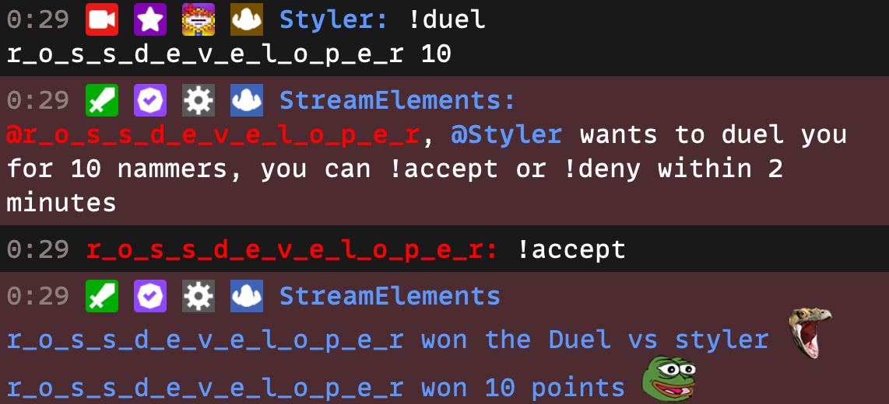

# Duel

### Description

The StreamElements chatbot duel module is an interactive chat game. In this game, users can challenge each other to a duel.

**How the game works:**

1. The game begins when a user initiates the command `!duel <user> <points>`.
2. The challenged user has the option to accept or decline the duel.
3. If the duel is accepted, the game randomly determines the winner.
4. The winner receives the points wagered in the duel.

**Winning:**

The winner of the duel is randomly determined by the game.

### Commands

- [!duel](/chatbot/commands/default/duel) - Challenges another user to a duel.
- [!accept](/chatbot/commands/default/accept) - Accepts a duel challenge.
- [!deny](/chatbot/commands/default/deny) - Declines a duel challenge.

### Settings

Name | Description
--- | ---
Cooldown | The cooldown period between duel challenges.
Maximum amount | The maximum amount of points that can be wagered in a duel.

### Example

