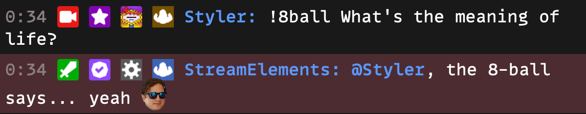

# Eightball

### Description

The StreamElements 8ball module is an interactive chat feature. In this module, users can ask the 8ball a question, and it will respond with a random answer. The answers can be customized in the module settings.

**How the module works:**

1. A user sends a message in chat with the command to ask the 8ball a question. The command is typically formatted as "!8ball [question]".
2. The 8ball responds with a random answer from the list of possible answers.
3. The list of possible answers can be customized in the module settings.

### Commands

Command | Description |
--- | --- |
!8ball question | Ask the 8ball a question. |

### Example

