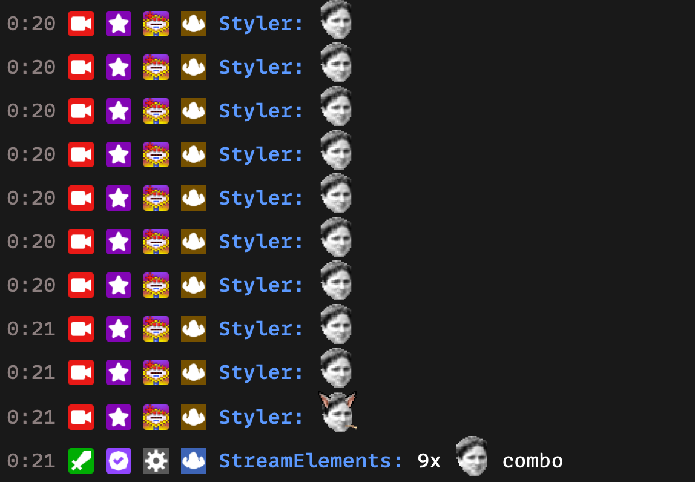

---
tags:
  - chatbot
  - module
  - emotecombo
---

# Emote Combo

The emote combo module is an interactive chat feature. In this module, users try to send the same emote consecutively in the chat.

**How the module works:**

1. The combo begins when a user sends a message containing a single emote.
2. The next message should contain the same emote to continue the combo.
3. The combo count increases each time the same emote is sent consecutively.
4. The combo ends when a different emote or message is sent.

**Combo Count:**
The combo count is displayed in the chat, showing the number of times the same emote has been sent consecutively.

### Commands

- None

### Example

