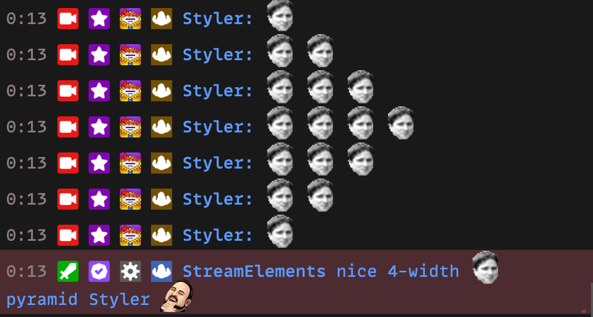

---
tags:
  - chatbot
  - module
  - emotepyramid
---

# Emote Pyramid

### Description

The StreamElements emote pyramid module is a fun chat game. In this game, users attempt to create a pyramid of emotes in the chat.

**How the game works:**

1. The game begins when a user sends a message containing a single emote.
2. The next message should contain the same emote, but repeated twice.
3. Subsequent messages should continue the pattern, increasing the repetition of the emote by one each time.
4. The game continues until the pyramid is completed or interrupted.

**Interruptions:**
The pyramid is considered interrupted if:

- Another user sends a different message.
- The same emote is not repeated the correct number of times.

### Commands

- None

### Example

