# Websockets

## Astro Websocket Gateway

Astro is StreamElements' dedicated websocket gateway. It employs a publish-subscribe (pubsub) pattern to facilitate real-time data updates.

### Connection

Connect to the WebSocket endpoint:

```
wss://astro.streamelements.com/
```

If reconnecting after a graceful shutdown, include the reconnect token as a query parameter:

```
wss://astro.streamelements.com/?reconnect_token=eyJhbGciOiJIUzI1NiIs...
```

If the server is draining, it rejects new connections with **502 Bad Gateway**.

If the connection rate limit is exceeded, it responds with **429 Too Many Requests** and a `Retry-After: 2` header.

### Welcome Message

Immediately after connecting, the server sends a `welcome` message:

```json
{
  "id": "01J5KXYZ...",
  "ts": "2026-03-19T12:00:00Z",
  "type": "welcome",
  "data": {
    "message": "You are in a maze of dank memes, all alike.",
    "client_id": "01J5KXYZ..."
  }
}
```

### Heartbeat

The server sends WebSocket `PING` frames every **30 seconds**. The client must respond with `PONG`. If the server receives no pong within **70 seconds**, it closes the connection.

These are WebSocket control frames, not application-level JSON messages. Most WebSocket libraries handle pong responses automatically.

### Client-to-Server Request

The following parameters are used in a client-to-server request:

| Parameter         | Type     | Description                                                                                                                                                                          |
| ----------------- | -------- | ------------------------------------------------------------------------------------------------------------------------------------------------------------------------------------ |
| `type`            | `string` | Defines the type of request. Valid options are `subscribe` and `unsubscribe`.                                                                                                        |
| `nonce`           | `string` | A unique identifier for the request. Echoed back in the response (optional).                                                                                                         |
| `data.topic`      | `string` | The topic to subscribe to (required).                                                                                                                                                |
| `data.room`       | `string` | The room/channel to subscribe to. Defaults to `""` (global). For `unsubscribe`, if omitted or empty, unsubscribes from all rooms for the topic.                                     |
| `data.token`      | `string` | The token used to authenticate the request (required for `subscribe`).                                                                                                               |
| `data.token_type` | `string` | Specifies the type of token. Valid options are `jwt`, `oauth2`, and `apikey`.                                                                                                        |

Only text frames are accepted. Binary frames are ignored.

Here is an example of a subscribe request:

```json
{
  "type": "subscribe",
  "nonce": "req-001",
  "data": {
    "topic": "channel.activities",
    "room": "603abc123",
    "token": "eyJhbGc...",
    "token_type": "jwt"
  }
}
```

Here is an example of an unsubscribe request:

```json
{
  "type": "unsubscribe",
  "nonce": "req-002",
  "data": {
    "topic": "channel.activities",
    "room": "603abc123"
  }
}
```

To unsubscribe from all rooms for a topic, omit or send an empty `room`:

```json
{
  "type": "unsubscribe",
  "nonce": "req-003",
  "data": {
    "topic": "channel.activities"
  }
}
```

### Server-to-Client Messages

| Parameter | Type     | Description                                                             |
| --------- | -------- | ----------------------------------------------------------------------- |
| `id`      | `string` | Unique message identifier (ULID).                                       |
| `ts`      | `string` | Timestamp in RFC 3339 format.                                           |
| `type`    | `string` | Message type: `welcome`, `response`, `message`, or `reconnect`.         |
| `topic`   | `string` | Present on `message` type. The topic the message was published to.      |
| `room`    | `string` | Present on `message` type. The room the message was published to.       |
| `nonce`   | `string` | Present on `response` type. Echoes the nonce from the original request. |
| `error`   | `string` | Present on `response` type when an error occurred.                      |
| `data`    | `object` | The message payload.                                                    |

Here is an example of a successful subscribe response:

```json
{
  "id": "01J5KXYZ...",
  "ts": "2026-03-19T12:00:01Z",
  "type": "response",
  "nonce": "req-001",
  "data": {
    "message": "successfully subscribed to topic",
    "topic": "channel.activities",
    "room": "603abc123"
  }
}
```

:::note
The `room` in the response is the canonical room ID returned by the authorization service, which may differ from the requested value.
:::

### Receiving Messages

When a message is published to a topic the client is subscribed to:

```json
{
  "id": "01J5M2AB...",
  "ts": "2026-03-19T12:05:00Z",
  "type": "message",
  "topic": "channel.activities",
  "room": "603abc123",
  "data": {
    "type": "follow",
    "provider": "twitch",
    "channel": "603abc123"
  }
}
```

The `data` field contains the payload from the publisher. See individual [topic pages](./topics/index.md) for payload details.

### Error Codes

All errors are returned as `response` messages:

```json
{
  "id": "01J5KXYZ...",
  "ts": "2026-03-19T12:00:01Z",
  "type": "response",
  "nonce": "req-001",
  "error": "err_bad_request",
  "data": {
    "message": "human readable description"
  }
}
```

| Error                  | Description                                                          |
| ---------------------- | -------------------------------------------------------------------- |
| `err_internal_error`   | Server-side failure.                                                 |
| `err_bad_request`      | Malformed request, missing fields, limit exceeded, or invalid topic. |
| `err_unauthorized`     | Authentication failed or permission denied.                          |
| `err_deadline_exceeded`| Authorization timed out. Retry the request.                          |
| `rate_limit_exceeded`  | Command rate limit exceeded.                                         |
| `invalid_message_type` | Unknown command type (not `subscribe` or `unsubscribe`).             |

### Connection Lifecycle

```mermaid
sequenceDiagram
    participant Client
    participant Edge as Edge Server

    Client->>Edge: WebSocket Upgrade
    Edge-->>Client: 101 Switching Protocols
    Edge-->>Client: welcome message

    Client->>Edge: subscribe {topic, token}
    Note over Edge: Auth check
    Edge-->>Client: response {success/error}

    loop Every 30s
        Edge-->>Client: PING
        Client->>Edge: PONG
    end

    Edge-->>Client: message {topic, room, data}
    Edge-->>Client: message {topic, room, data}

    Client->>Edge: unsubscribe {topic, room}
    Edge-->>Client: response {success}

    rect rgb(60, 60, 80)
        Note over Client,Edge: Graceful Shutdown
        Edge-->>Client: reconnect {token}
        Client->>Edge: New connection + reconnect_token
        Edge-->>Client: welcome (subscriptions restored)
    end
```



### Reconnection

Astro supports zero-downtime reconnection during graceful server shutdown.

1. The server sends a `reconnect` message to each client:

```json
{
  "type": "reconnect",
  "data": {
    "message": "The server is shutting down.",
    "reconnect_token": "eyJhbGciOiJIUzI1NiIs..."
  }
}
```

2. The client saves the `reconnect_token` and opens a new connection:

```
wss://astro.streamelements.com/?reconnect_token=eyJhbGciOiJIUzI1NiIs...
```

3. The new server verifies the token and restores all subscriptions automatically — no need to re-subscribe.

4. The client receives a `welcome` message and resumes normal operation.

Invalid, expired, or tampered reconnect tokens cause the new connection to be closed immediately.

## Available Topics

For a complete list of available topics and their detailed descriptions, see the [Topics](./topics/index.md) page.

## Code Examples

For implementation examples in different programming languages, see the [Code Examples](./examples/index.md) page.

## FAQ

**Q: Why are the messages not coming through? I received the message `successfully subscribed to topic`!**

A: Make sure you're using the token for the specific platform from which you want to receive activities. If you have multiple accounts linked (Twitch, YouTube, Kick, etc.), switch to the correct account on the StreamElements dashboard (click your avatar in the top-right corner) and copy the token again.

**Q: I'm not receiving YouTube activities, and I'm using the correct token.**

A: If your stream is set to `private` or `unlisted`, StreamElements cannot access it. Only public YouTube livestreams are supported.

**Q: How can I make sure I copied the correct token?**

A: If you are using either a JWT or an Overlay Token (apikey), go to the StreamElements dashboard, click your avatar in the top-right corner > select your channel name, and choose the correct channel. After that, you can copy the correct token.
