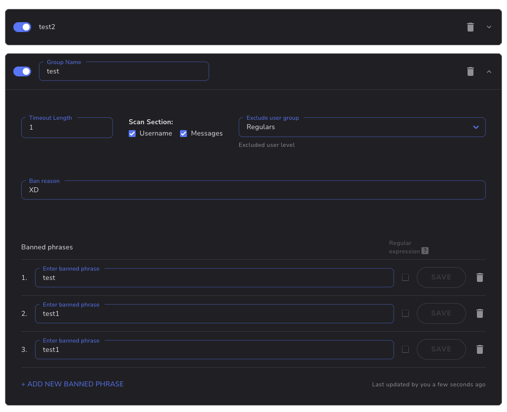

The Banned Words filter is a tool that helps maintain the chat environment by removing messages that contain banned phrases and patterns. This filter is highly customizable and supports the creation of multiple groups, each with its own set of banned phrases.

These phrases can be simple text or they can be regular expressions (regexp), providing a high degree of flexibility in defining what constitutes a banned phrase. For example, you could ban a specific word, or use a regular expression to ban any word that contains a certain sequence of characters.

To use this filter, simply define your groups and their associated banned phrases or patterns. Any incoming message that matches a banned phrase or pattern in any group will be automatically removed.

## Settings

| Setting | Description |
|---------|-------------|
| Groups | Banned phrases are organized into groups, each with its own set of phrases. Click the **Add Group** button to create a new group (named **Group 1** by default). |
| Banned phrases | The phrases the filter matches messages against. Each entry can be simple text or a regular expression. |

## Examples

- Plain phrase: `badword` — removes any message containing the phrase "badword".
- Regular expression (example pattern): `/b[aá]dword/` — also catches spelling variants such as "bádword".

