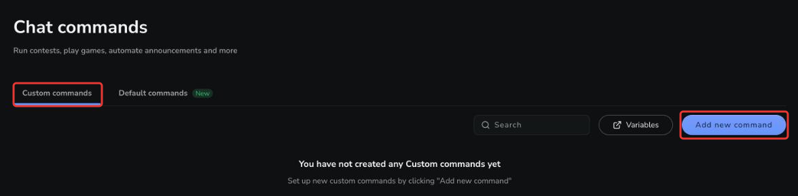
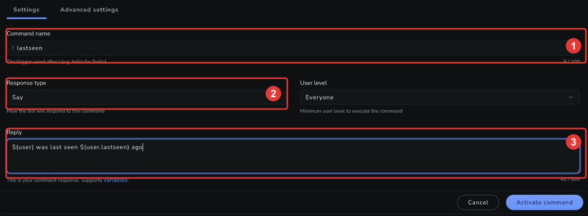
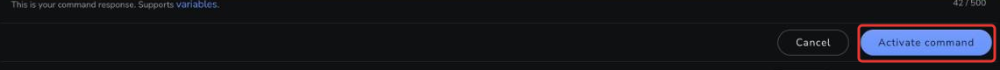
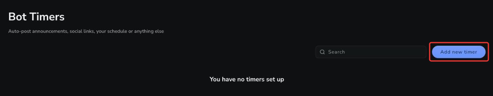
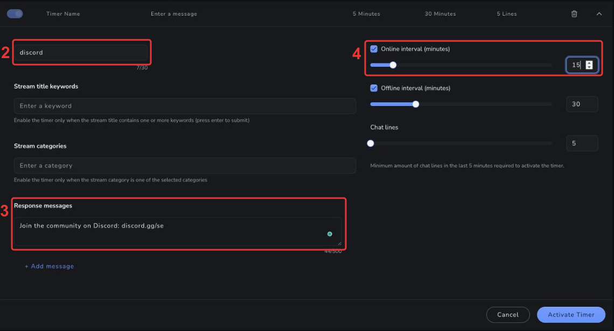

import { Steps } from '@astrojs/starlight/components';
import ChatExample from '@components/ChatExample.astro';

This guide walks you through the two most common ways to put the StreamElements Chatbot to work: creating your first custom command and setting up your first timer.

## Your first command

Commands are the main way users will interact with the bot in your chat. They can be used to trigger actions, or to display information to your users. In this example we will create a command that shows how long it has been since a user was last seen in chat.

<Steps>

1. From the [bot command dashboard](https://streamelements.com/dashboard/bot/commands), navigate to the "Custom Commands" tab.

2. Click the "Add New Command" button to open the command creation tool.

   

3. Enter the desired name for your new command. For this example we will name the command "lastseen".

4. Optional: In the "Response Type" dropdown, select the method you would like the bot to use to send the response.
   - "Say" will send the response as a chat message as it is entered in the basic settings.
   - "Mention" will send the response as a chat message, but will prefix the message with [`@$(user),`](/chatbot/variables/sender).
   - "Reply" will send the response as a native reply to the user who triggered the command.
     - NOTE: If the platform does not support native replies, the response will be sent as a "Mention" instead.
   - "Whisper" will send the response as a whisper to the user who triggered the command.

5. Add the response. For our example, enter:

   ```streamelements
   $(user) was last seen $(user.lastseen) ago
   ```

   [`$(user)`](/chatbot/variables/user) and its sub-variables target the name typed after the command — or the person who used the command, when no name is given. For a list of all available variables, see the [variables documentation](/chatbot/variables).

   

6. Optional: Add one or more command aliases to allow users to trigger the same command using alternate names.

7. Click the "Activate Command" button to save your new command.

   

</Steps>

That's it — the command is live in your chat:

<ChatExample messages={[
  { persona: 'user', message: '!lastseen SomeViewer' },
  { persona: 'bot', message: 'SomeViewer was last seen 5 mins 30 secs ago' }
]} />

## Your first timer

Timers allow you to automatically post announcements, social links, schedules, or any other messages at regular intervals in your chat.

<Steps>

1. From the [bot timers dashboard](https://streamelements.com/dashboard/bot/timers), click the "Add new timer" button in the top right corner.

   

2. In the expanded timer settings, enter a name for your timer in the "Timer Name" field.

3. Enter the message you want the timer to post under "Response messages".

4. Set the "Online interval (minutes)". This is how often the timer will post while your stream is live.

   

5. Click the "Activate Timer" button at the bottom of the timer settings.

6. The timer will now appear in your list of timers, where you can enable/disable it using the toggle switch.

</Steps>

For the remaining settings — offline interval, chat lines, multiple messages, and stream title or category conditions — see the [Timers](/chatbot/timers) reference.

## Next steps

- Learn more about creating and managing [custom commands](/chatbot/commands/custom).
- Browse all available [variables](/chatbot/variables) you can use in responses.
- Read the [Timers](/chatbot/timers) reference for a full overview of timer settings.
- Explore [Modules](/chatbot/modules) and [Spam Filters](/chatbot/filters) to take your chatbot further.
