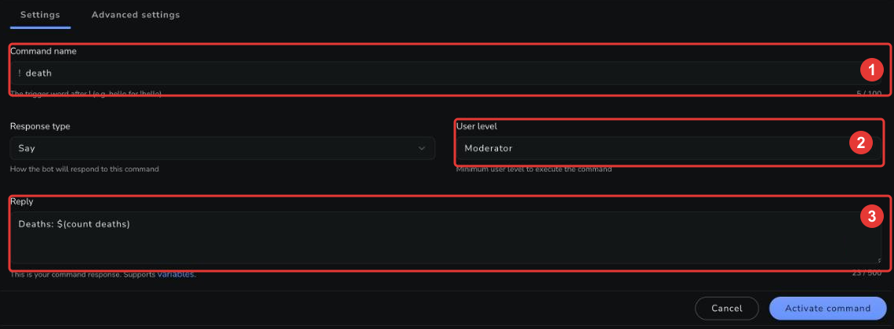

import { Steps } from '@astrojs/starlight/components';
import ChatExample from '@components/ChatExample.astro';

A death counter is three small commands: one that counts a death, one that shows the score without changing it, and one that resets it for the next game. It's built on the chatbot's [counters](/chatbot/counters), so the count survives stream restarts.

## The counting command

<Steps>

1. From the [bot command dashboard](https://streamelements.com/dashboard/bot/commands), open the "Custom commands" tab and click "Add new command".

2. Name the command `death`, set the "User level" to **Moderator** so random chatters can't inflate your death count, and enter this reply:

   ```streamelements
   Deaths: $(count deaths)
   ```

   

3. Click "Activate command".

</Steps>

Every use of [`$(count deaths)`](/chatbot/variables/count) adds 1 to the counter and prints the new total — so each `!death` in chat is one more death:

<ChatExample messages={[
  { persona: 'moderator', message: '!death' },
  { persona: 'bot', message: 'Deaths: 4' }
]} />

## Checking the score without counting

For a command everyone can use, read the counter with [`$(getcount)`](/chatbot/variables/getcount) — it outputs the value without adding to it. Create a second command named `deaths` (User level: Everyone) with the reply:

```streamelements
We have died $(getcount deaths) times so far
```

<ChatExample messages={[
  { persona: 'user', message: '!deaths' },
  { persona: 'bot', message: 'We have died 4 times so far' }
]} />

## Corrections and resets

The counter takes modifiers: `+n` adds, `-n` subtracts, and a bare number sets it. A moderator-level reset command with the reply below puts the counter back to zero between games:

```streamelements
Death counter reset ($(count deaths 0))
```

You can also fix miscounts on the fly — `$(count deaths -1)` in any moderator command takes one back.

:::caution
Modifiers only work in the space-separated form: `$(count deaths +5)`. In the dot form, `$(count.deaths +5)` treats `+5` itself as the counter name — see the [`$(count)` reference](/chatbot/variables/count).
:::

## Managing counters

Counters are created automatically the first time they're used and persist until you change them. You can view and edit every counter — including `deaths` — in the dashboard under **Chatbot → Counters**, and moderators can use the [`!editcounter`](/chatbot/commands/default/editcounter) default command from chat.

## Related

- [Counters](/chatbot/counters): How counters work, with the full syntax.
- [`$(count)`](/chatbot/variables/count) and [`$(getcount)`](/chatbot/variables/getcount): The two variables this guide is built on.
- [Custom Commands](/chatbot/commands/custom): Everything else you can do with custom commands.
