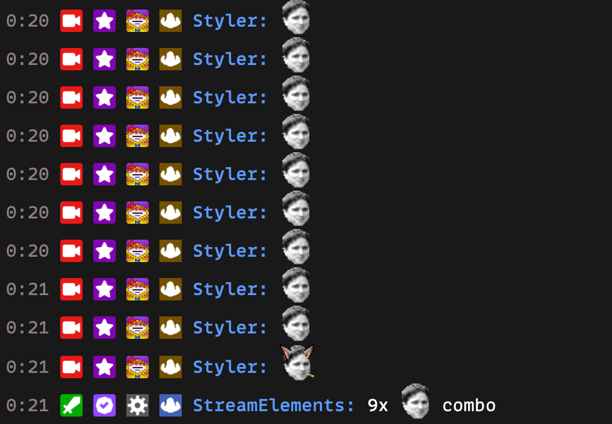

import ChatExample from '@components/ChatExample.astro';

The Emote Combo feature is an interactive chat module that encourages viewers to create chains of consecutive emotes. It adds a fun, engaging element to your stream by challenging viewers to maintain and extend emote streaks.

## How It Works

The Emote Combo feature activates automatically when viewers start sending consecutive emote messages in chat:

1. A viewer initiates the combo by sending a message containing an emote.
2. Each following message that contains the active emote extends the combo. A message counts once, no matter how many times the emote appears in it.
3. The combo does not require different viewers — the same viewer can keep a combo going on their own.
4. The combo ends when a message is sent that does not contain the active emote. If the final count reached the minimum combo count, the bot announces the combo.

## Example

<ChatExample messages={[
  { persona: 'user', usernameOverride: 'Viewer1', message: 'Kappa' },
  { persona: 'user', usernameOverride: 'Viewer2', message: 'Kappa' },
  { persona: 'user', usernameOverride: 'Viewer3', message: 'Kappa' },
  { persona: 'user', usernameOverride: 'Viewer4', message: 'Kappa' },
  { persona: 'user', usernameOverride: 'Viewer5', message: 'Nice stream!' },
  { persona: 'bot', message: 'Viewer5 just disrupted the 4-line Kappa combo DansGame' }
]} />

## Configuration

Streamers can customize the following settings in the StreamElements dashboard:

- Whether the module is enabled
- Minimum combo count before the bot responds (default: 3)
- Cooldown between bot responses (default: 30 seconds)
- Tiered messages: a list of messages, each with a minimum count — the message with the highest minimum at or below the final combo count is used

The combo messages support the following placeholders:

| Placeholder | Description |
|-------------|-------------|
| `{user}` | The login name of the user who broke the combo |
| `{count}` | The final combo count |
| `{emote}` | The combo emote |

## FAQ

**Q: Can I use custom emotes for the Emote Combo?**
A: Yes, both Twitch global emotes and channel-specific emotes work with the Emote Combo feature.

**Q: Is there a limit to how long a combo can be?**
A: No
