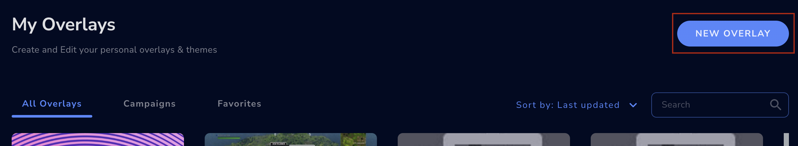
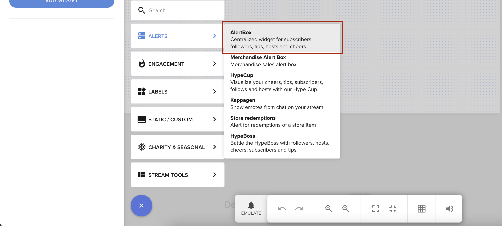
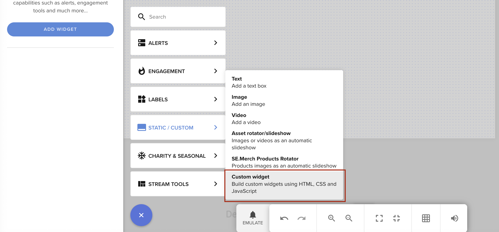

import { Steps, CardGrid, LinkCard } from '@astrojs/starlight/components';

This guide explains how to create a Custom Widget or Custom Code AlertBox using StreamElements' Overlay Editor UI.

We'll start by creating an Overlay, then add widgets like an AlertBox and a Custom Widget, which you can edit.

## Creating an Overlay

<Steps>

1. Navigate to the [Overlays](https://streamelements.com/dashboard/overlays) section.

2. Click the **NEW OVERLAY** button.

   

3. Choose your resolution and click the **START** button.

   :::tip
   Overlay size: Usually it should match your stream's resolution, or be smaller if you'd like to do the repositioning in your broadcasting software.
   :::

</Steps>

## AlertBox

The AlertBox is a native widget that displays live events from the queue in a popup-like behavior.

To create an AlertBox:

<Steps>

1. Click the **+** button in the overlay editor.

   

2. Select **AlertBox** in the **ALERTS** section.

   

</Steps>

### Enabling Custom Code for AlertBox

To enable custom code for AlertBox:

<Steps>

1. Open options for AlertBox.

2. Go to the tab for the alert type you want to customize (e.g. Followers).

3. Toggle the "Enable custom CSS" option for the alert type you want to use.

</Steps>

<video controls width="100%">
  <source src="/video/alertbox-css-editor.mp4" />
  Your browser does not support embedded videos. The video demonstrates enabling the "Enable custom CSS" option in the AlertBox settings.
</video>

## Custom Widget

The Custom Widget is a native widget that you can use to display any content you want. It's ideal for displaying your own content in the overlay and can consume local events (like tips, follows, etc.) as well as remote events read from a websocket or REST API.

To create a Custom Widget:

<Steps>

1. Click the **+** button in the overlay editor.

   

2. Select **Custom Widget** in the **STATIC/CUSTOM** section.

   

</Steps>

## Next steps

<CardGrid>
  <LinkCard
    title="Your First Custom Widget"
    href="/overlays/first-custom-widget/"
    description="Step-by-step tutorial: define fields, write HTML/CSS/JS, and react to a follow event."
  />
  <LinkCard
    title="Code Editor"
    href="/overlays/widget-structure/"
    description="Write HTML, CSS, JavaScript, and custom field definitions in the Custom Code Editor."
  />
  <LinkCard
    title="Custom Code in Alertboxes"
    href="/overlays/custom-code-in-alertbox/"
    description="Build fully custom alert designs with inline template variables for names, amounts, and messages."
  />
</CardGrid>
