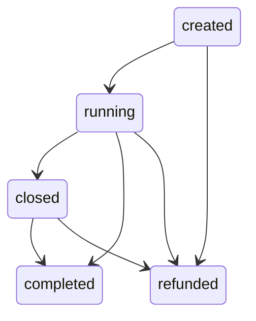

This topic carries contest and prediction events: state changes, vote/bet updates, and winner announcements.

## Payload

| Parameter | Type | Description |
| --------- | ---- | ----------- |
| `room` | `string` | Channel ID |
| `data.event` | `string` | Event type: `update`, `state`, or `winner` |
| `data.payload` | `object` | Event-specific payload data |

## Example

```json
{
    "id": "01KC4840ZZ1BAMK5R2V9QX9BNA",
    "ts": "2025-01-15T14:30:00Z",
    "type": "message",
    "topic": "channel.contests",
    "room": "577c0455f9a31ea72a36b2b3",
    "data": {
        "event": "state",
        "payload": {}
    }
}
```

## Events

| Event | Description |
| ----- | ----------- |
| `update` | Vote/bet placed |
| `state` | Contest state changed |
| `winner` | Winner selected |

### update

Sent when a user places a vote or bet on a contest option.

```json
{
    "event": "update",
    "payload": {
        "optionId": "507f1f77bcf86cd799439011",
        "amount": 100,
        "userId": "12345678"
    }
}
```

| Parameter | Type | Description |
| --------- | ---- | ----------- |
| `optionId` | `string` | ID of the option voted for |
| `amount` | `number` | Amount bet |
| `userId` | `string` | ID of the user who placed the bet |

### state

Sent when the contest state changes.

```json
{
    "event": "state",
    "payload": {
        "state": "running",
        "contestId": "507f1f77bcf86cd799439011"
    }
}
```

| Parameter | Type | Description |
| --------- | ---- | ----------- |
| `state` | `string` | New state: `created`, `running`, `ended`, `completed`, `refunded`, or `closed` |
| `contestId` | `string` | Contest ID (only present on start) |

### winner

Sent when a winner is selected.

```json
{
    "event": "winner",
    "payload": {
        "winnerId": "507f1f77bcf86cd799439011"
    }
}
```

| Parameter | Type | Description |
| --------- | ---- | ----------- |
| `winnerId` | `string` | ID of the winning option |

## State Transitions



A winner can be selected while the contest is still `running`, so `completed` can follow `running` directly without passing through `closed`. A refund can be issued from any state.

| State | Description |
| ----- | ----------- |
| `created` | Contest created but not started |
| `running` | Accepting bets |
| `closed` | Voting stopped, awaiting winner selection |
| `completed` | Winner selected, rewards distributed |
| `refunded` | Contest cancelled, bets returned |
| `ended` | Legacy state — still part of the schema but no longer produced by current systems |

## Data Types

### Contest

| Field | Type | Description |
| ----- | ---- | ----------- |
| `channel` | `string` | Channel ID |
| `title` | `string` | Contest title |
| `description` | `string` | Contest description |
| `minBet` | `number` | Minimum bet amount |
| `maxBet` | `number` | Maximum bet amount |
| `botResponses` | `boolean` | Whether bot responses are enabled |
| `options` | `array` | Array of contest options |
| `totalAmount` | `number` | Total amount bet across all options |
| `totalUsers` | `number` | Total number of users who bet |
| `duration` | `number` | Contest duration |
| `startedAt` | `string` | ISO 8601 timestamp when contest started |
| `endedAt` | `string` | ISO 8601 timestamp when contest ended |
| `active` | `boolean` | Whether contest is active |
| `state` | `string` | Current state: `created`, `running`, `ended`, `completed`, `refunded`, or `closed` |

### ContestOption

| Field | Type | Description |
| ----- | ---- | ----------- |
| `_id` | `string` | Option ID |
| `command` | `string` | Command to vote for this option |
| `title` | `string` | Option title |
| `totalAmount` | `number` | Total amount bet on this option |
| `totalUsers` | `number` | Number of users who bet on this option |
| `winner` | `boolean` | Whether this option won |

## Related

- [Activities](/websockets/topics/channel-activities) - General channel activity events
- [Websockets](/websockets) - General information about the Astro WebSocket Gateway
